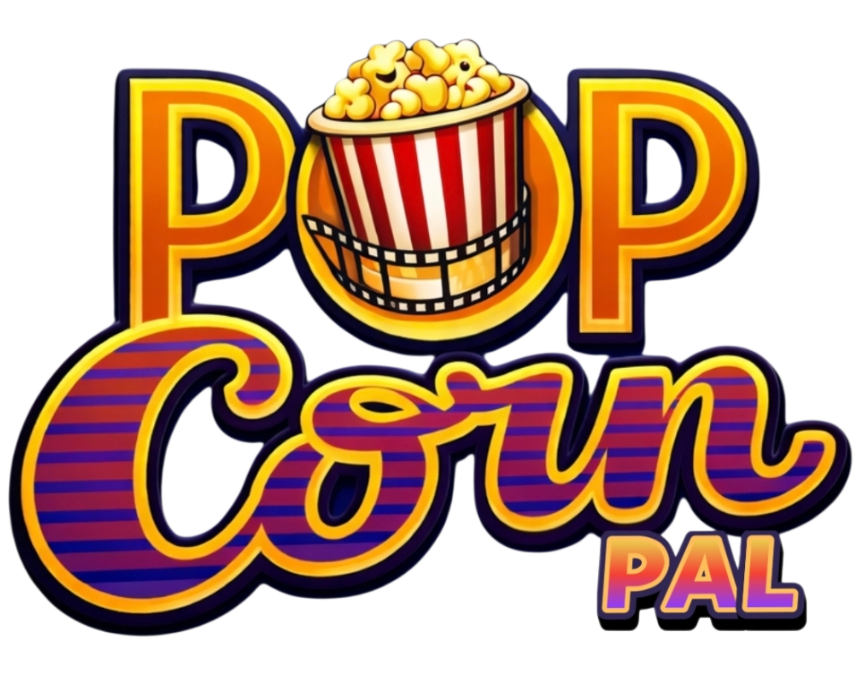
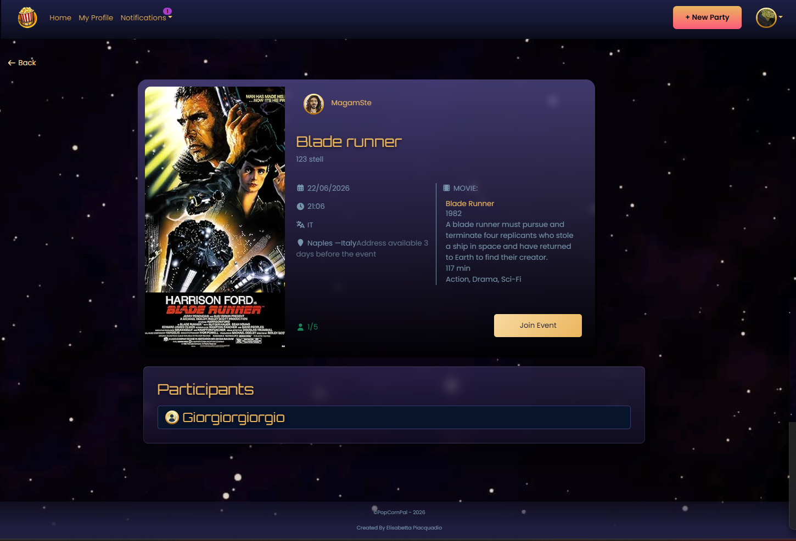
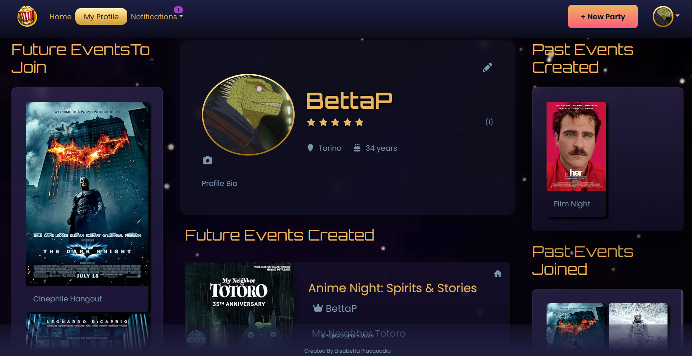

# 🍿 PopcornPal --- Frontend

## Overview

PopcornPal is a web app that lets people connect through their shared love for movies.\
Users can create events, join others, and interact through a simple and
intuitive interface.

## Live Demo

API Base URL: https://supposed-fanni-popcornpal-app-5b907ec9.koyeb.app\
Frontend: https://popcornpal-ep.vercel.app

## Backend Repository

https://github.com/bettapcq/PopCornPal_be

## Tech Stack

- React
- Vite
- Redux
- React Router
- React Bootstrap
- React Testing Library (testing base)
- Vitest (testing base)

## Features

- User authentication
- Create and manage events
- Join events with approval system
- Notifications
- Rating system

## Screenshots

### Home

### Event Details

### Profile

## Setup

git clone https://github.com/bettapcq/PopCornPal_fe.git\
npm install

Create a .env file:\
VITE_API_URL=http://localhost:8080

Run:\
npm run dev

## Notes

- Requires backend running
- API URL configurable via .env

## Demo Credentials

Email: test@test.com\
Password: PasswordTest1!
